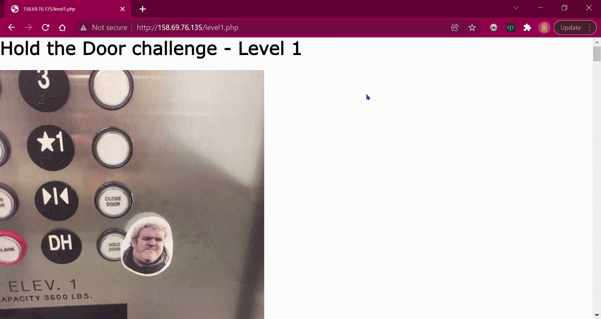

<a href="https://github.com/brerickner/">
    
</a> 

# HODOR
<p align="center">
<a href="https://scrutinizer-ci.com/g/brerickner/hodor/?branch=master"></a>
<a href="https://scrutinizer-ci.com/g/brerickner/hodor/build-status/master"></a>
<a href="https://scrutinizer-ci.com/code-intelligence"></a>
</p>

<p align="center">
<a href="#how-to-use">How To Use</a> •
<a href="#levels-zeroonetwotrophy">Levels</a> •
<a href="#resources-provided--bookmark_tabs">Resources Provided</a> •
<a href="#features--rocket">Features</a> •
<a href="#licensescroll">License</a>
</p>


HOLD THE DOOR ...while **Bre** hacks some online voting contests!!!  

> _This project is meant for educational purposes only_
>
> Many online contests make gathering votes a part of their process for choosing winners. The problem is that a lot of them are designed with flaws… 

##  How To Use

To run these script you will need **Python3** and **pip** installed. It's also imperative you have the ***requests*** *module* installed. **Requests** is a third party module, to install it globally, please use the command:

#### Linux/Mac
```bash
$ pip install requests
```
#### Windows
```bash
$ python -m pip install requests
```
####  **Voting for a different ID:**   
* Done by modify the *value* associated with the key 'id' when constructing the *voteBre dict*.

####  **Altering the number of times you vote:**
* Done by adjusting the parameter of *range()* during the initialization of the *for loop*


**Running the Python Script:**
```bash
# Clone this repository
$ git clone https://github.com/brerickner/hodor.git  

# Go into the repository of desired level
$ cd hodor/level_0  

# Run the script
$ ./level_0.py  

# Stop/Cancel the script
(Ctrl + C)
```

## Levels :zero::one::two::trophy: 

### Level 0 :white_check_mark:  

`Write a script or a program that votes for Bre's Holnerton ID 1024 times!`
*  You can use the language of your choice
*  [CONTEST PAGE](http://158.69.76.135/level0.php) :checkered_flag:  

#### Demo:
>

##### **Repo:**
>
> - **GitHub repository:** [hodor](https://github.com/brerickner/hodor)
> - **Py Script:** [level_0](https://github.com/brerickner/hodor/blob/master/level_0/level_0.py)   

&nbsp;

### Level 1 :white_check_mark:

`Write a script or a program that votes for Bre's Holberton ID 4096 times!`
*  Webpage uses cookies
*  You can use the language of your choice
*  [CONTEST PAGE](http://158.69.76.135/level1.php) :checkered_flag:
#### Demo:  
> 

##### **Repo:**
>
> * **GitHub repository:** [hodor](https://github.com/brerickner/hodor)
> * **Py Script:** [level_1](https://github.com/brerickner/hodor/blob/master/level_1/level1.py)

&nbsp;

### Level 2 :white_check_mark:

`Write a script or a program that votes for Bre's Holberton ID 1024 times! `
*  Contest only allows votes from Windows users
*  You can use the language of your choice
*  [CONTEST PAGE](http://158.69.76.135/level2.php) :checkered_flag:

#### Demo:  
> 

##### **Repo:**
>
> *   **GitHub repository:** [hodor](https://github.com/brerickner/hodor)
> *   **Py Script:** [level_2](https://github.com/brerickner/hodor/blob/master/level_2/level_2.py)

## Resources Provided  :bookmark_tabs:

**Read or watch**:

>*   [HTTP headers](https://www.google.com/search?q=http+headers+explained+post&oq=http+headers+explained+post)
>*   [Scraping](/rltoken/L2HhLK0iyncmurlkigh5yw "Scraping")
>*   [OCR for Captcha](https://www.google.com/search?q=solving+captcha+with+ocr)
>*   [TOR](https://www.google.com/search?q=tor)
>*   [Proxy lists](https://www.google.com/search?q=proxy+lists)

## Features  :rocket:

- [x] HTTP POST Automation
- [x] Success Message
- [x] Hack online voting contest
- [x] Hack online voting contest *with* cookies
- [x] Hack online voting contest as a *Window's* User
- [ ] Hack online voting contest with captcha
## License:scroll:

MIT  


